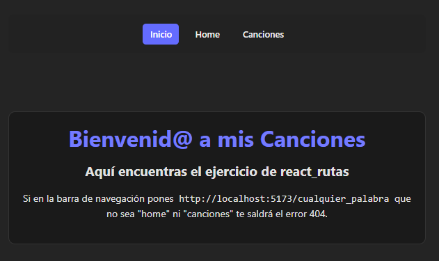

# 🎵 React Canciones

Este es un proyecto en **React + Vite** que muestra una lista de canciones y practica el uso de **rutas con React Router**.

## 🚀 Características

- Página de inicio en las rutas `/` y `/home`.
- Lista de canciones en `/canciones`, cargadas desde un archivo JSON.
- Página de error **404** cuando se accede a rutas inexistentes.
- Barra de navegación simple con estilos básicos en CSS.
- Componentes modulares (`Home`, `CancionesList`, `NotFound`).

## 📂 Estructura

```bash
react_rutas/
├─ public/
│ ├─ canciones.json # Canciones con título, álbum, duración, etc.
│ └─ images/
├─ src/
│ ├─ components/
│ │ ├─ Home/
│ │ │ ├─ Home.jsx
│ │ │ └─ Home.module.css
│ │ ├─ CancionesList/
│ │ │ ├─ CancionesList.jsx
│ │ │ └─ CancionesList.css
│ │ ├─ NotFound/
│ │ │ ├─ NotFound.jsx
│ │ │ └─ NotFound.css
│ │ └─ Navbar/
│ │ ├─ Navbar.jsx
│ │ └─ Navbar.css
│ ├─ App.jsx
│ ├─ App.css
│ ├─ index.css
│ └─ main.jsx
├─ .gitignore
├─ package.json
└─ README.md
```
---

## 📦 Instalación

Clona el repositorio e instala dependencias:

```bash
git clone https://github.com/arni91/react_rutas.git
cd react_rutas
npm install

```
---

## ▶️ Ejecución en desarrollo
```bash
npm run dev
```
La aplicación se abrirá en http://localhost:5173

---

## 🛠️ Build para producción

```bash
npm run build
npm run preview
```
---
## ✨ Captura de pantalla



---

## 📚 Aprendizaje

Este proyecto sirvió para practicar:

    Rutas en React Router (incluyendo 404).

    Manejo de JSON como fuente de datos.

    Uso de componentes funcionales y props.

    Estilos con CSS y CSS Modules.

---

