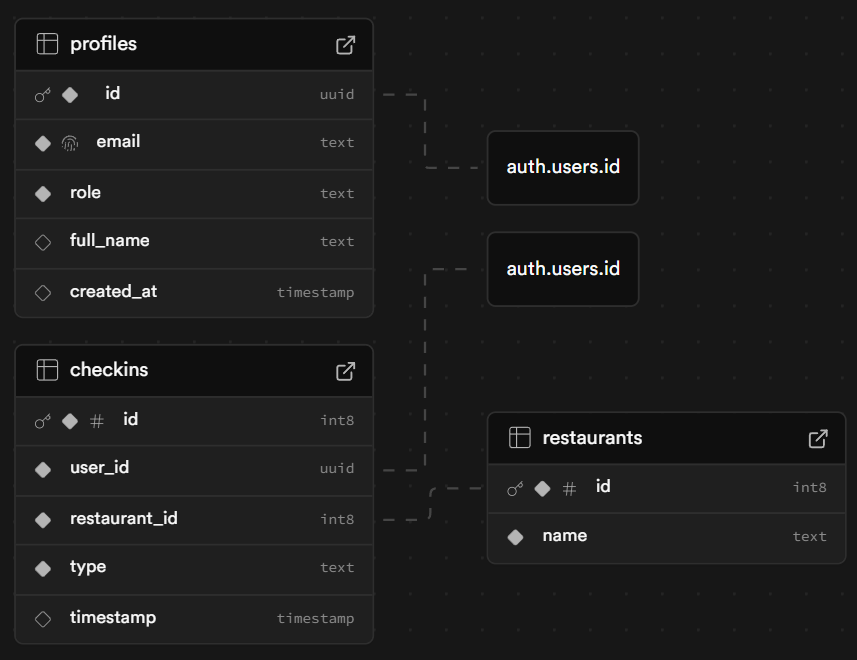

# InOut — App de fichajes para restaurantes

Aplicación Fullstack desarrollada con **React** (frontend) y **Supabase** (backend como servicio).  
Permite a los trabajadores fichar entradas y salidas en distintos restaurantes, y a los administradores gestionar los fichajes y trabajadores desde un panel de control.

---

## 🚀 Tecnologías utilizadas

- **Frontend:** React + Vite + React Router
- **Backend:** Supabase (PostgreSQL + Auth + RLS)
- **Auth:** Supabase Auth (email/password)
- **Estilos:** CSS Modules
- **Testing:** Jest (integración CRUD sobre Supabase)
- **Control de versiones:** Git + GitHub

---

## 📦 Requisitos previos

- [Node.js](https://nodejs.org/) v18 o superior  
- Una cuenta en [Supabase](https://supabase.com)  
- Variables de entorno configuradas en un archivo `.env`

---

## ⚙️ Instalación y arranque local

1. **Clonar repositorio**

   ```bash
   git clone https://github.com/arni91/M3_project.git
   cd inout
   ```
2. Instalar dependencias
 
    ```bash
    npm install
    ```
3. Configurar variables de entorno

    Crea un archivo .env en la raíz con el contenido:

    ```bash 
    VITE_SUPABASE_URL=https://<tu-proyecto>.supabase.co
    VITE_SUPABASE_ANON_KEY=<tu-anon-key>
    ```
4. Arrancar frontend

    ```bash
    npm install
    npm run dev
    ```
    Por defecto se abre en http://localhost:5173

## 🗄️ Base de datos (Supabase)

Tablas principales

- profiles → perfiles de usuario vinculados a auth.users

  -  id (uuid, pk)
  - email (text)
  - role (text: worker/admin)
  - full_name (text)
  - created_at (timestamp)

- restaurants → restaurantes disponibles
  
  - id (bigint, pk)
  - name (text)

- checkins → fichajes de entrada/salida

  - id (bigint, pk)
  - user_id (uuid)
  - restaurant_id (bigint)
  - type (text: in/out)
  - timestamp (timestamp)



Seguridad (RLS)

- Activado en todas las tablas.
- Workers → solo pueden ver/editar su propio perfil y fichajes.
- Admins → acceso completo a perfiles, fichajes y gestión de restaurantes.
- Restaurantes → lectura pública (para poder probar conexión sin login).


## 🌐 Funcionalidades

Frontend

- Login / Registro con Supabase Auth.
- Worker Page (/worker):
  - Fichar entrada/salida en un restaurante.
  - Ver tabla de fichajes propios.
  - Cálculo de horas acumuladas.

- Admin Page (/admin):
  - Listado de trabajadores con buscador por nombre/email.
  - Ver fichajes de cada trabajador.
  - Ver detalle de un fichaje.
  - Editar o eliminar fichajes.

- Botón "Probar conexión" en la barra de navegación:
  - Realiza un ping contra Supabase.
  - Muestra estado ✅ Conexión OK o ❌ Conexión FAIL.

Backend (Supabase)

- Persistencia real en PostgreSQL gestionado por Supabase.
- Policies de seguridad (RLS).
- Trigger automático para crear profile al registrar un usuario.

## 🔎 Rutas principales (frontend)

- / → Login / Registro
- /worker → Panel de trabajador
- /admin → Panel de administrador

## 🧪 Pruebas

Test de integración (Jest)

Se incluye un test en tests/checkins.test.js que valida el CRUD completo de checkins:

- Crear fichaje
- Leer fichaje
- Actualizar fichaje
- Borrar fichaje

```bash 
npm test
```
## 📚 Cómo usar la aplicación

1. Registrar un usuario worker desde la pantalla de inicio.
2. Promover un usuario a admin (ejemplo admin@inout.com):

    ```bash
    update profiles
    set role = 'admin'
    where email = 'admin@inout.com';
    ```
3. Acceder con worker → fichar entradas/salidas.
4. Acceder con admin → gestionar trabajadores y fichajes.
5. Probar conexión → usar el botón en la barra superior.

## 👨‍💻 Autor

arni


